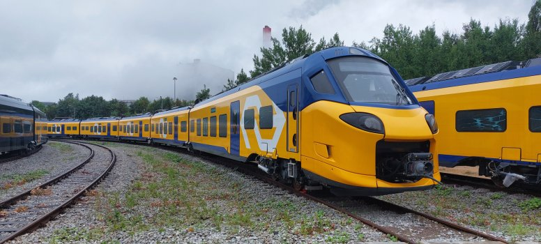

## Introduction

NS passengers make more than **one million journeys per day** [@ns2025Performance].

In this presentation, we will take a look at some metrics such as train types, punctuality, seat availability and disruptions. All while using reported figures from the NS Annual Report 2025.

## Sprinter and Intercity

::: columns
::: {.column width="50%"}
### Sprinter

{width="100%"}

- Stops at almost every intermediate station.
- Serves local and regional journeys.
:::

::: {.column width="50%"}
### Intercity

{width="100%"}

- Stops mainly at larger stations.
- Serves medium and longer journeys.
:::
:::

Source: @nsTrains.

## Connections

A journey involves the departure station, train service and arrival station. Some journeys also require a change of train.

Almost **80% of NS passengers do not need to change trains** [@ns2025Performance]. For passengers who do, punctuality affects whether the connection is made.

## Passenger punctuality in 2025 {.smaller}

On the main rail network, **85.5%** of passenger journeys arrived within **3 minutes** and **95.3%** within **10 minutes**. The 10-minute figure includes the 3-minute journeys.

```{r}
#| label: fig-punctuality
#| echo: false
#| fig-align: center
#| fig-width: 10
#| fig-height: 2.5
#| out-width: "100%"
#| dev: png
#| dev.args: !expr list(bg = "transparent") # to remove the white background

library(ggplot2)

punctuality <- data.frame(
  threshold = factor(
    c("Within 3 minutes", "Within 10 minutes"),
    levels = c("Within 10 minutes", "Within 3 minutes")
  ),
  percent = c(85.5, 95.3)
)

ggplot(punctuality, aes(x = threshold, y = percent)) +
  geom_col(width = 0.5, fill = "#353691") +
  geom_text(
    aes(label = paste0(percent, "%")),
    hjust = -0.15, size = 6.5, fontface = "bold",
    colour = "#353691"
  ) +
  coord_flip() +
  scale_y_continuous(
    limits = c(0, 108),
    breaks = c(0, 25, 50, 75, 100),
    labels = function(x) paste0(x, "%"),
    expand = c(0, 0)
  ) +
  labs(x = NULL, y = NULL) +
  theme_minimal(base_size = 18) +
  theme(
    panel.grid.major.y = element_blank(),
    panel.grid.minor = element_blank(),
    panel.background = element_rect(fill = "transparent", colour = NA),
    plot.background = element_rect(fill = "transparent", colour = NA),
    axis.text.y = element_text(size = 18, colour = "#252525"),
    axis.text.x = element_text(size = 13, colour = "#555555"),
    plot.margin = margin(5, 35, 5, 5)
  )
```

The difference is **9.8 percentage points** [@ns2025Accessibility].

## Seat availability in 2025

NS estimates the chance that a second-class passenger could sit for the **whole journey** [@ns2025Accessibility]:

- **92.4%** during peak hours
- **98.2%** during off-peak hours

NS reports particularly busy peak periods on Tuesdays and Thursdays [@ns2025Performance].

## Selected performance indicators {.smaller}

The table shows six percentage indicators. Search and sort to compare the 2025 result, annual minimum and 2029 target [@ns2025Accessibility].

```{r}
#| label: tbl-scorecard
#| echo: false
scorecard <- read.csv("data/ns_2025_scorecard.csv", check.names = FALSE)
DT::datatable(scorecard, rownames = FALSE,
              options = list(pageLength = 6, dom = "ftip", scrollX = TRUE))
```

## Difference from the 2029 target {.smaller}

For each indicator, we subtract the 2029 target from the 2025 result:

$$
\begin{aligned}
g_j &= \text{result}_{2025,j} - \text{target}_{2029,j} \\
g_{\text{3-minute punctuality}} &= 85.5 - 86.0 = -0.5\ \text{pp} \\
g_{\text{off-peak seats}} &= 98.2 - 97.9 = +0.3\ \text{pp}.
\end{aligned}
$$

“pp” means percentage points. A negative value is below the target.

For example, to list the indicators below target in R:

```{r}
#| eval: false
#| echo: true
subset(scorecard, `Result 2025` < `Target 2029`)
```

## Interactive comparison {.smaller}

Each dot is the 2025 result minus the 2029 target. [@ns2025Accessibility].

```{r}
#| label: fig-target-gaps
#| echo: false
#| fig-height: 5
scorecard$gap <- round(scorecard$`Result 2025` - scorecard$`Target 2029`, 1)
scorecard$Status <- ifelse(scorecard$gap >= 0, "Met target", "Below target")
scorecard$PlotLabel <- sub(" on the main rail network",
                           "<br>on the main rail network", scorecard$Indicator,
                           fixed = TRUE)
scorecard$PlotLabel <- sub(" in second class", "<br>in second class",
                           scorecard$PlotLabel, fixed = TRUE)
scorecard$PlotLabel <- sub(", including disruptions", ",<br>including disruptions",
                           scorecard$PlotLabel, fixed = TRUE)
scorecard$PlotLabel <- factor(scorecard$PlotLabel,
                              levels = scorecard$PlotLabel[order(scorecard$gap)])
scorecard$detail <- paste0(scorecard$Indicator,
                           "<br>2025: ", scorecard$`Result 2025`, "%",
                           "<br>2029 target: ", scorecard$`Target 2029`, "%",
                           "<br>Difference: ", sprintf("%+.1f", scorecard$gap), " pp")
plotly::plot_ly(scorecard, x = ~gap, y = ~PlotLabel, color = ~Status,
                colors = c("Below target" = "#586e75", "Met target" = "#268bd2"),
                type = "scatter", mode = "markers", text = ~detail,
                hovertemplate = "%{text}<extra></extra>",
                marker = list(size = 17)) |>
  plotly::layout(
    xaxis = list(title = "Difference from 2029 target (percentage points)",
                 range = c(-1.5, 1.2), dtick = 0.5, zeroline = FALSE),
    yaxis = list(title = ""),
    shapes = list(list(type = "line", x0 = 0, x1 = 0, y0 = 0, y1 = 1,
                       yref = "paper", line = list(color = "#777", dash = "dash"))),
    legend = list(orientation = "h", x = 0, y = 1.14),
    margin = list(l = 460, r = 30, t = 65, b = 75))
```

## Disruptions

NS reported **77 high-impact disruptions attributable to it** in 2025 [@ns2025Accessibility].

A broken-down train can block a track. Following trains then lose time, and some passengers may miss a connection [@ns2025Performance].

NS and ProRail have added minutes at selected locations in the timetable to help trains recover from small delays [@ns2025Performance].

## Which targets were met?

How many of the six indicators had reached their 2029 target in 2025?

```{r}
#| label: count-at-target
#| cache: true
#| echo: true
sum(scorecard$`Result 2025` >= scorecard$`Target 2029`)
```

Three of the six results met or exceeded the 2029 target. The indicators measure different aspects of the service.

## References

::: {#refs}
:::
